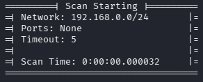
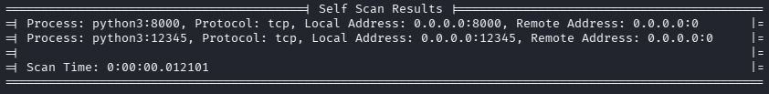
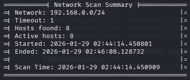

# Quickstart

This page covers the minimum steps to install and run Network Analyzer.

## Prerequisites

- **Linux required** for the Self Scan feature (it reads from `/proc`).
- **Python 3.12+**.
- **Privileges**: ARP/ICMP/SYN scanning and traceroute typically require **root** or `CAP_NET_RAW`.

!!! note "Scapy dependency"
    Network scanning features rely on Scapy for raw packet operations. If you see permission errors or unexpectedly empty results, try running with `sudo`.

## Install

Create and activate a virtual environment:

```bash
python3 -m venv .venv
source .venv/bin/activate
```

Install dependencies:

```bash
pip install -r misc/requirements.txt
```

## Run a first network scan

A typical first run is an **all** scan over a small CIDR range. For `--scanType=all`, you must provide `--ports`.

```bash
sudo python3 -m src.main --network=192.168.0.0/24 --hostid=ARP --timeout=5 --scanType=all --verbose
```

## Run a local Self Scan

Self Scan inspects your local machine's listening sockets. It does not require `--network`.

```bash
sudo python3 -m src.main --scanType=SS
```

## Confirm it worked

You should see boxed sections such as:

- **Scan Starting**  


- **Self Scan Results** (runs as part of `--scanType=all`)  


- **Host Scan (i/N)** per discovered host  


- **Network Scan Summary** (not printed in `SelfScan`-only mode)  



## Next steps

- [Tutorials](tutorials.md)
- [How-to guides](how-to.md)
- [Reference](reference.md)
